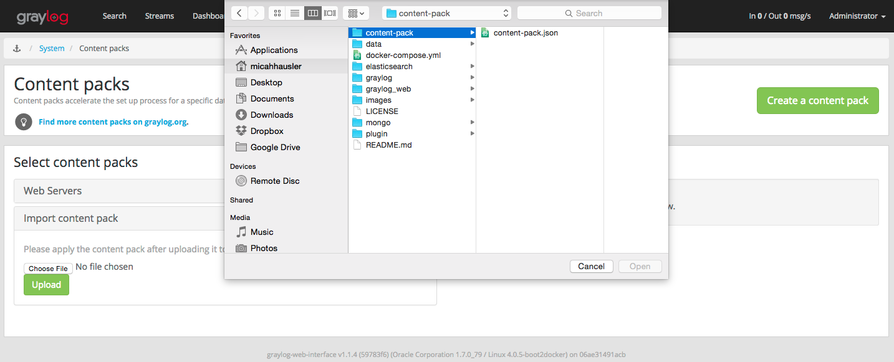
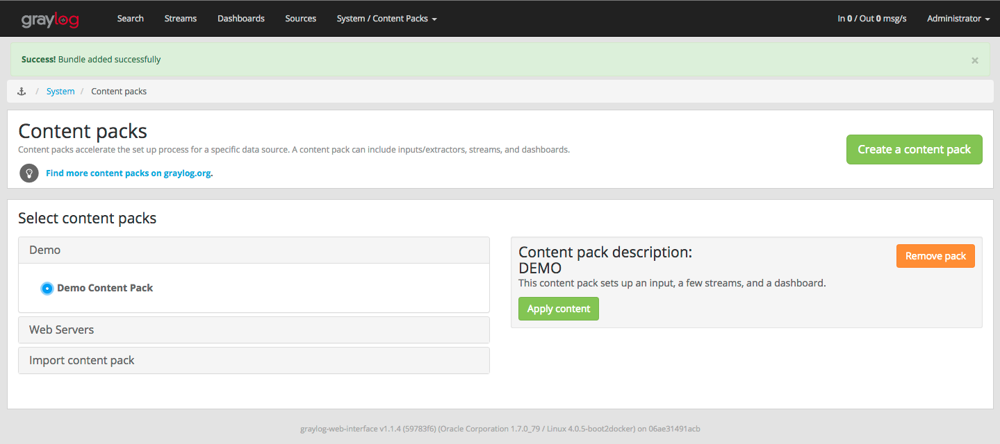

# Graylog in docker-compose
This `docker-compose.yml` runs all the required processes for a Graylog setup on multiple docker containers.

The following processes are run in their own docker containers

* mongodb
* elasticsearch
* graylog 1.1.4
* graylog-web 1.1.4

## Setup
This setup assumes you already have docker-compose and docker (using boot2docker) installed.

```
git clone git@github.com:micahhausler/graylog-compose.git
cd graylog-compose
docker-compose build
docker-compose up
```

## Play
Open [https://192.168.59.103:9443/](https://192.168.59.103:9443/) and use the login. (It may take a minute for the graylog server to come online)

```
username: admin
password: password
```

Then go to the [Content Packs](https://192.168.59.103:9443/system/contentpacks) page, upload the provided content pack, and then click "Apply content".



 

### Input
You can now go to the [Inputs page](https://192.168.59.103:9443/system/inputs) and see that the Docker GELF input has been entered to consume [logspout](https://github.com/gliderlabs/logspout) mesages from Docker (using the [GELF module](https://github.com/micahhausler/logspout-gelf)).

### Streams
Go to the [Streams page](https://192.168.59.103:9443/streams#) to see the example streams that have been created. Clock on each one to see past messages.

_[Hint: Open an incognito window and enter an invalid password in the Graylog login page. This will generate some content for you to see in your streams and dashboard.]_

### Dashbaords
Go to the [Dashboards page](https://192.168.59.103:9443/dashboards) to see an example dashboard with graphs based on the 2 preconfigured streams.

### Plugins
Go to the [Graylog Plugin page](https://www.graylog.org/resources/integrations/) to see available plugins. Simply drop them in the `plugin/` directory in the project, and they'll be loaded when you restart Graylog.

### API explorer
Go to the Graylog API-Explorer [http://192.168.59.103:12900/api-explorer/](http://192.168.59.103:12900/api-explorer/) From here, you can play around with their [swagger](http://swagger.io/) api explorer.

If you're using `docker-machine` instead of boot2docker, edit the line

```
rest_transport_uri= http://192.168.59.103:12900/
```
in `graylog/server.conf` and change it to your docker machine's IP. You'll need to restart everything for this to take effect by running

```
docker-compose stop
docker-compse rm -f
docker-compose up
```


## Security
This is NOT a production-ready setup for graylog. You'll need add TLS to [Mongo](https://docs.mongodb.org/manual/reference/configuration-options/#net-ssl-options), [Elasticsearch](https://www.elastic.co/guide/en/shield/current/reference.html#ref-ssl-tls-settings), and the [graylog server](https://gist.github.com/micahhausler/e0b1b47738ee170c6caf#file-server-conf-L56-L68), as well as fine-tune each service for your own needs. This list of measures is not comprehensive.

Be sure to:

* change the `password_secret` in `graylog/server.conf` and also add it to `graylog_web/graylog-web-interface.conf`'s `application.secret` parameter
* change the `root_password_sha2` in `graylog/server.conf`
* Add authentication to mongo, enter the parameters in `graylog/server.conf`

## License
MIT License